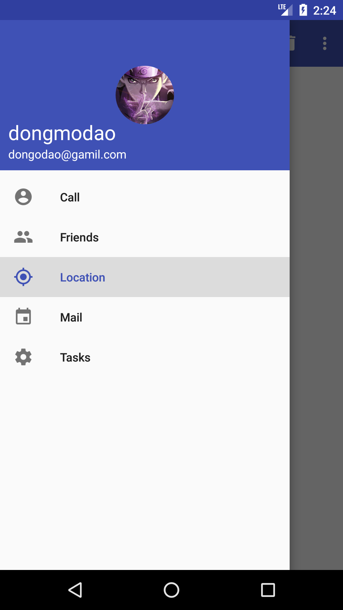

## 侧滑菜单的优化
这是这个系列的第三篇文章。今天是在以前的基础上实现优化，上一次的侧滑菜单只是一个简单的 TexiView，今天我们将要把它做的更加好看、更加符合一般在 APP 中看到的样子。今天的成果图如下：
<!-- more -->


### 菜单页面定制布局
谷歌给我们提供一个很好的方法来实现上述的功能，就是 NavigationView。NavigationView 是 Design Support 库中提供的一个控件，所以我们首先要添加对应的依赖项。在 app/build.gradle 中添加依赖项如下：
``` xml
    compile 'com.android.support:appcompat-v7:25.3.0'
    compile 'com.android.support:design:25.3.0'
    compile 'de.hdodenhof:circleimageview:2.1.0'
```
注意依赖包的版本问题，support 包的版本要一致，此处我用的是 25.3.0 的版本。其中的 circleimageview 是一个实现图片圆形化的包。

另外，在 NavigationView 中，我们还需要准备两个布局，一个 menu 和 一个 headerLayout，分别对应的是成果图中的下部菜单选项和上部个人信息部分。在 menu 文件夹中生成一个 nav_menu.xml 文件，编写：
``` xml
<?xml version="1.0" encoding="utf-8"?>
<menu xmlns:android="http://schemas.android.com/apk/res/android">
    <group android:checkableBehavior="single">
        <item
            android:id="@+id/nav_call"
            android:icon="@drawable/account_circle"
            android:title="Call"/>
        <item
            android:id="@+id/nav_friends"
            android:icon="@drawable/people_white"
            android:title="Friends"/>
        <item
            android:id="@+id/nav_location"
            android:icon="@drawable/my_location"
            android:title="Location"/>
        <item
            android:id="@+id/nav_mail"
            android:icon="@drawable/event"
            android:title="Mail"/>
        <item
            android:id="@+id/nav_task"
            android:icon="@drawable/settings_white"
            android:title="Tasks"/>
    </group>
</menu>
```
在 layout 文件夹中同理新建一个 nav_header.xml 文件，编写如下
``` xml
<?xml version="1.0" encoding="utf-8"?>
<RelativeLayout xmlns:android="http://schemas.android.com/apk/res/android"
    android:layout_width="match_parent"
    android:layout_height="180dp"
    android:padding="10dp"
    android:background="?attr/colorPrimary">

    <de.hdodenhof.circleimageview.CircleImageView
        android:id="@+id/icon_image"
        android:layout_width="70dp"
        android:layout_height="70dp"
        android:layout_centerInParent="true"
        android:src="@drawable/avatar"/>

    <TextView
        android:id="@+id/mail"
        android:layout_width="wrap_content"
        android:layout_height="wrap_content"
        android:layout_alignParentBottom="true"
        android:text="dongodao@gamil.com"
        android:textColor="#FFF"
        android:textSize="14sp"/>

    <TextView
        android:id="@+id/username"
        android:layout_width="wrap_content"
        android:layout_height="wrap_content"
        android:layout_above="@id/mail"
        android:text="dongmodao"
        android:textColor="#FFF"
        android:textSize="24sp"/>
</RelativeLayout>
```
于是准备工作就完成了，接下来就在 activity_main.xml 中使用 NavigationView， 在 DrawerLayout 中删除原来的 TextView 布局，并添加子布局如下：
``` xml
<android.support.design.widget.NavigationView
    android:id="@+id/nav_view"
    android:layout_width="match_parent"
    android:layout_height="match_parent"
    android:layout_gravity="start"
    app:menu="@menu/nav_menu"
    app:headerLayout="@layout/nav_header"/>
```
于是乎，关于页面的部分就写完了。接下来就是在界面中侧滑菜单上显示出来了，转到 activity_main.xml 中，在 onCreate 中加入如下代码：
``` java
NavigationView navView = (NavigationView)findViewById(R.id.nav_view);
navView.setCheckedItem(R.id.nav_call);
navView.setNavigationItemSelectedListener(new NavigationView.OnNavigationItemSelectedListener(){
    @Override
    public boolean onNavigationItemSelected( MenuItem item) {
        mDrawerLayout.closeDrawers();
        return true;
    }
});
```

到了这里，我们就已经基本实现了侧滑菜单了。这次就先到这里吧，最近时间段比较忙，这篇也被迫推到了现在。。本来基本每周周五都有时间来进行更新，这周进行实验然后也就被用去了这段时间，唉，加油吧以后！！！

## 小说明
下次更新这个系列应该是比较久之后了吧，毕竟这是学习郭神的书写的，以后打算写一些自己的东西。最近觉得只有那些自己能写出个一二三来的东西，才是自己比较了解的，对自己的帮助也更大。所以以后还是尽量写干货，这也是一个重复学习的过程。如果一味的学习人家的东西而不加入自己的成分就没有太多效果了，这也是我后面要多写自己的东西的原因之一。Anyway，加油！

> ### 如果想要了解的更仔细，请阅读郭霖大神著作 《第一行代码（第二版）》。

<center> --- end --- </center>

---
