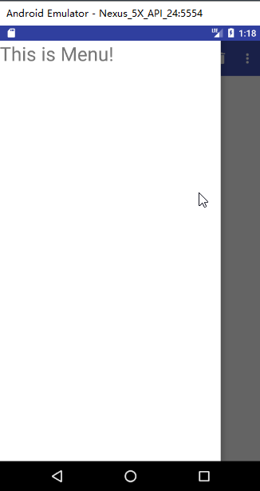
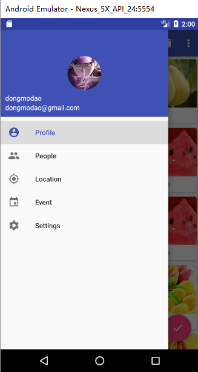

<center>
Author: dongmodao
</center>


## 接上篇
今天来讲讲如何实现侧滑菜单。效果图如下：<!--more-->



看上去是不是很丑陋？我觉得也是（捂脸）。不过后续我们会逐步完善它，使得它成为下面这样的：



是不是就高大上不少呢！嘿嘿，不过凡事都要慢慢来，一口吃不成胖子，我们今天还是实现第一张图的效果吧。话不多说，开工！

2\.  DrawerLayout 实现侧滑菜单
侧滑菜单，顾名思义，就是把一些菜单隐藏，不在主屏幕上显示，通过滑动的方式将菜单显示出来。为了实现这个效果，我们需要使用谷歌提供了一个  DrawerLayout  控件。这个控件实现侧滑菜单很方便。

DrawerLayout 是一个布局，其中允许放入两个直接子控件，第一个子控件是显示主屏幕内容，第二个则是菜单的内容。在  activity_main.xml 中修改：
``` xml
<android.support.v4.widget.DrawerLayout
    xmlns:android="http://schemas.android.com/apk/res/android"
    xmlns:app="http://schemas.android.com/apk/res-auto"
    android:id="@+id/drawer_layout"
    android:layout_width="match_parent"
    android:layout_height="match_parent">

    <FrameLayout...>

    <TextView
        android:layout_width="match_parent"
        android:layout_height="match_parent"
        android:layout_gravity="start"
        android:text="This is Menu!"
        android:textSize="30sp"
        android:background="#FFF"/>

</android.support.v4.widget.DrawerLayout>
```
在上面的 FrameLayout 中的部分就是我们上次主屏幕的布局代码，请主动移除其中多余的名字空间。此时在侧滑菜单中，我们看到只加入了一个 TextView，所有在当前的状态就只能看到一行字。其中要注意的是：
``` bash
android:layout_gravity="start"
```
这个属性是必须指定的，start 表示根据系统语言的书写方向显示菜单的方向，也可以定义 left, right。意思很明显，此处不多解释。
此时，如果我们运行程序，通过滑动就可以看到侧滑菜单了。但是很多人有可能不会发现这个功能，所以我们给它加上一个导航按钮。在 MainActivity  中修改：
``` java
public class MainActivity extends AppCompatActivity {

    private DrawerLayout mDrawerLayout;

    @Override
    protected void onCreate(Bundle savedInstanceState) {
        super.onCreate(savedInstanceState);
        setContentView(R.layout.activity_main);
        Toolbar toolbar = (Toolbar)findViewById(R.id.toolbar);
        setSupportActionBar(toolbar);
        mDrawerLayout = (DrawerLayout)findViewById(R.id.drawer_layout);
        ActionBar actionBar = getSupportActionBar();
        if(actionBar != null){
            actionBar.setDisplayHomeAsUpEnabled(true);
            actionBar.setHomeAsUpIndicator(R.drawable.ic_menu);
        }
    }

    @Override   //菜单栏的点击事件
    public boolean onOptionsItemSelected(MenuItem item){
        switch (item.getItemId()){
            case android.R.id.home:
                mDrawerLayout.openDrawer(GravityCompat.START);
                break;
            ...
            default:
          }
          return true;
   }
```
上面的代码应该很好理解，说明的一点就是 HomeAsUp 也即是 Toolbar 最左侧的按钮，默认是箭头，此处对它进行了修改，其 id 永远是 android.R.home，主要不要少了 android。
至此，在 Toolbar 的最左侧就有了一个按钮，可以打开侧滑菜单。今天的任务也就完成了。

#### 小说明
这个布局系列后面还会继续，不过不一定是连续发，因为我可能写一个近期看的东西，比如最近在研究谷歌的基本 MVP 架构，也许下次先讲这个。至于布局系列可能会延后，不过不会停更。（如果发现有什么问题可以联系我）。

> ### 如果想要了解的更仔细，请阅读郭霖大神著作 《第一行代码（第二版）》。

<center> --- end --- </center>

---
