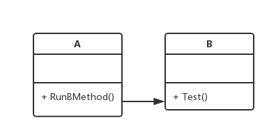
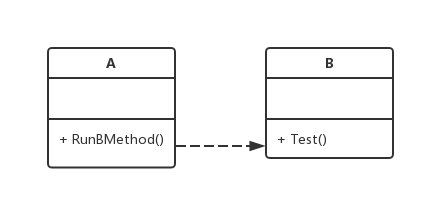
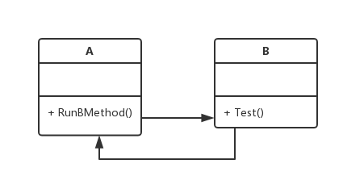
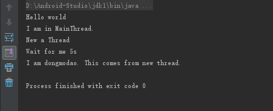

<center>
Author: dongmodao
</center>


## 写在前面

最近随着期中的临近，感觉作业越来越多，过两天还是集中轰炸，感觉药丸啊！虽然还是有点作死的感觉，没有先把自己的作业做完就折腾着自己的 Android Studio，但是收获多少还是有一些的吧。在这个过程中，真的是越来越能感觉到自己的不足，发现在很多方面都很难做到很好。不过这个在学习的过程中毕竟是不可避免的。所以，这次要写的东西可能比较少，而且对于各位大神来说还是很鸡肋，但是还是要写的。（因为更多的问题还没有解决，所以没办法一次性写出来）。另外，虽然分享的东西少，但是也不能变成不分享，因为只要真的暂停了，那估计这股子劲就消失了。所以，加油吧！
<!-- more -->
## java 模块间的调用

不仅仅在 java 语言里面，我们在编程的时候模块之间的调用都是不可避免的。总的来说，调用主要有以下几个类型：
1\. 同步调用



同步调用是指类 A 调用类 B 中的某个方法，程序此时等待 B 中的这个方法执行完成。如果 B 需要使用较多的时间才能够完成任务，那么主线程（此时只有一个线程）就会发生阻塞。所以这种调用方法适合非耗时的调用。

2\. 异步调用



异步调用是的出现，避免了主线程的阻塞的发生。所谓的异步，就是指类 A 新建一个线程去运行类 B 中的某一个耗时的操作，或者在类 B 中的操作中是在线程中进行的，A类的方法直接对其调用。这样就程序中就运行了一个主线程和一个子线程，耗时工作在子线程中完成，主线程仍可以正常使用，不受耗时操作的影响。但是这样也会有一个问题，那就是，子线程和主线程的沟通问题，主线程不知道子线程的工作进行的程度，这在实际的编程中是不方便的。

3\. 回调机制



正是上述的两种方法不能很好的满足人们的需求，回调机制就出现了。所谓的回调是指在类 A 中执行类 B 的某种方法，但是类 A 持有一个 CallbackListstener， 这个监听器作为参数传入类 B 的方法中，当完成所需的操作后，调用监听器的方法，A 中的监听器就会执行对应的操作。

## 实战演练

下面是我的一个测试代码，很简单，请自行理解。
监听器接口：CallbackListstener
``` java
public interface CallbackListener {

    void onFinish(String info);

    void onError(Exception e);
}
```
其中的接口可以按自己的需要设定。
耗时的操作子线程：MyThread
``` java
public class MyThread {

    public static void ThreadSleep(final String mystr, final CallbackListener listener){
        new Thread(new Runnable() {
            @Override
            public void run() {
                try {
                    System.out.println(mystr);
                    System.out.println("Wait for me 5s");
                    Thread.sleep(5 * 1000);
                    String info = "I am dongmodao. This comes from new thread.";
                    if(listener != null){
                        listener.onFinish(info);
                    }
                } catch (InterruptedException e) {
                    e.printStackTrace();
                    listener.onError(e);
                }
            }
        }).start();
    }
}
```
测试程序主入口类：Test()
``` java
public class Test {
    public static void main(String[] args) {

        System.out.println("Hello world");

        MyThread.ThreadSleep("New a Thread", new CallbackListener() {
            @Override
            public void onFinish(String info) {
                // 根据返回结果执行具体内容的逻辑
                System.out.println(info);
            }

            @Override
            public void onError(Exception e) {
                // 执行异常处理
                System.out.println(e);
            }
        });

        System.out.println("I am in MainThread.");
    }
}
```
上面的代码应该很简单，很容易看的懂，此处就不在多加赘述。运行的结果如下：



## 写在后面

这次分享的内容感觉有点水。。。，其实应该很多人都知道了的，但是我却是刚刚有所涉及。。。这也是我认识自己不足的地方。总结起来，自己的基础不是很牢固，但是有时候又会比较急，所以总是感觉不真实。虽然有些水，但是也是我学习或者说复习的一个体现吧。本来这次是想写关于 RecyclerView 加载网页图片时错乱的解决方案的，但是一时间对于网上给的解决方案并不是非常认可，总感觉实现的不够好，比较乱(也可能是我弱鸡看不懂(捂脸))，所以就暂时没贴出来，等到我找到解决的方法的时候在发一下吧！

参考文章：
[Java回调机制解读](http://www.importnew.com/24220.html)

附上郭神的一个解决 ListView 加载网页图片错乱的网址 [Android ListView异步加载图片乱序问题，原因分析及解决方案](http://blog.csdn.net/guolin_blog/article/details/45586553)
<center> --- end --- </center>

---
