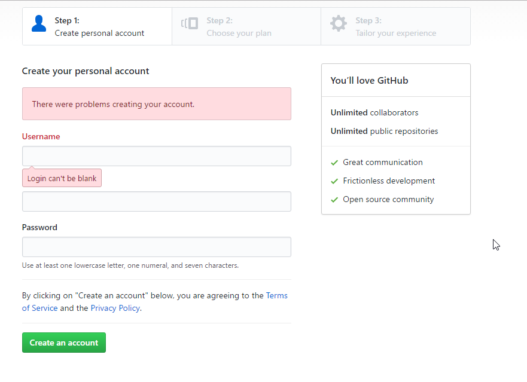
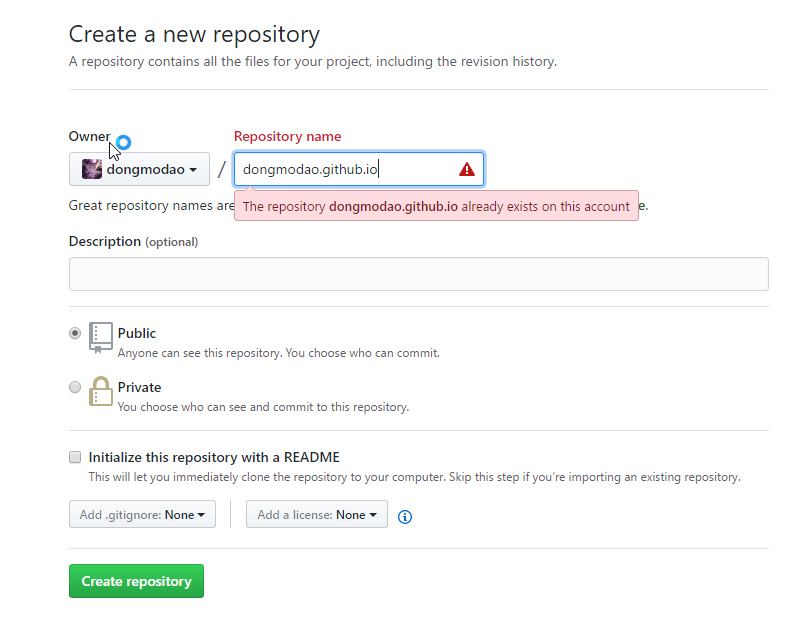
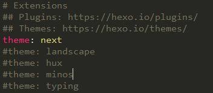
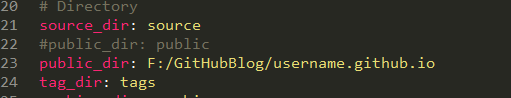

好久没有更新博客，这篇博客是在我建立博客初期时就已经新建好的的，只是后面因为嫌麻烦并且写了其他的一些东西，以至于这篇本该是最初完成的博客竟被排到这个时候。今天上午打算把遗留的问题以及空有框架的博客正式的补全一下。「2017/3/25」
<!--more-->
## 前言
写这个博客的原因主要有两点，一个是分享一下自己如何建立起这个博客的，尽可能详细的展现出来给大家。为什么分享？一个主要的原因就是我自己本省搭建这个博客的时候在网上搜索了各种各样的教程，但是不是所有的教程都是令人满意的。甚至在我看来，很多教程并不能成功的搭建起一个博客（其中可能是因为时间久远，以至于操作方法产生了很大的不同）。另一个就是作为我的一个「里程碑」式的记录吧。我想在这个博客上记录从今往后我在生活中遇到的一些问题，也可以记录一下自己的感受和体会，换言之，「以此志之」。

## 准备工作
在正式开始搭建博客之前，你需要进行一些准备工作。这些操作大多可以在[GitHub Pages](https://pages.github.com/) 的官方网站上看到，如果想看原文的可以点击跳转。
1\. 注册一个 GitHub 账号
登录 [「GitHub」官网](https://github.com) 注册一个账号，点击注册进入注册页面。如下：

填写相应的个人信息，按照流程走，一直到注册完成就可以了，

2\. 新建一个 repository
注册好一个账号之后就要新建一个 repository，名称为 username.github.io，更改 username 为你的用户名。我的如下（因为我已经新建过了，所以我的会报错，最初新建是不会报错的）：


3\. 安装 Git
如果已经安装了 Git 就可以跳过这个步骤。 [Git](https://git-scm.com/downloads) 可以在这里下载。安装过程应该不会有什么问题，随后在命令行中输入 git 命令，如果有响应，说明安装成功。如果失败，请自行 Google，此处就不再展开。
运行 git bash，运行以下命令：
``` bash
cd f:
mkdir GitHubBlog
cd GitHubBlog
git clone https://github.com/username/username.github.io  //记得更改 username
cd username.github.io
echo "Hello World" > index.html
git add --all
git commit -m "Initial commit"
git push -u origin master
```
此时，你就把远程的 repository 克隆到当前的「f:/GitHubBlog」目录之下了。并且在目录下创建了一个 index.html 文件。随后把本地代码块提交到了你的远端 GitHub 上面的 master 分支上。稍微等待后，你就可以在网址上输入 http://username.github.io 来看看效果。当然，现在网页上只出一行 Hello World，看上去很简陋，需要我们后面去完善它。该步骤完成。

4\. 安装 Node.js
[Node.js](https://nodejs.org/zh-cn/) 可以在这里获取，选择合适自己的版本下载，按照提示安装即可。

## 正式搭建
经过上面的操作我们已经得到了一个博客的雏形，接下来就是对它进行美观与配置。此处是使用 Hexo 来进行博客框架的搭建。此时，我假设你已经成功完成了上述步骤。下面就要开始使用 Hexo，在命令行中运行如下代码：
``` bash
npm install -g hexo-cli
```

此处是进行 hexo 的安装。下面的教程可以在 [Hexo](https://hexo.io) 官网看到，我只是进行了实例化而已。安装成功之后，在 git bash 中运行：
``` bash
cd F:/GitHubBLog
hexo init Blog
cd Blog
npm install
```
经过上面的代码之后，在「 F:/GitHubBLog」中新建了一个 Blog 文件夹，这就是以后我们管理博客的位置。此时，Hexo 已经帮我们建立好了博客的框架了。
运行：
``` bash
hexo s --debug
```
在浏览器中输入 localhost:4000，就可以看到它给我们自动生成的第一篇「Hello World」博客。这篇博客里面介绍的将是我们经常使用的内容。
到这里，搭建工作已经告一段落了。剩下的就是更换主题的工作了。更换主题要在「F:\GitHubBlog\Blog\themes」中下载好主题，可以看到当前已经有一个「landscape」文件夹，那就是我们当前的主题。
运行：
``` bash
cd themes
git clone https://github.com/iissnan/hexo-theme-next.git
```
就是转到 themes 文件夹，然后远程下载 next 主题。更多的主题可以去看 [hexo主题](https://hexo.io/themes/)。然后选中主题，再克隆到本地即可。
下载完成之后，修改 「Blog/_config.yml」 文件中的 theme 的值为：hexo-theme-next，即那你要使用的主题名称。如图：



## 新建博客
完成了上述的操作之后，我们已经把博客的框架搭建好了。下面来尝试新建一个新的文章。这些内容可以在自动生成的Hello World」中看到。这里就简单写一下。
运行：
``` bash
hexo n "新文章名"
```
自动在「source/_posts」文件夹下生成了「新文章名.md」文件，这个就是博客的主体。使用 Sublime Text 或者 Atom 等支持 Markdown 语法的文本编辑器编写内容。
``` bash
hexo s --debug
```
在 debug 模式下运行本地服务器，可以在浏览器中查看当前的博客状态。参数 --debug 非必须。
``` bash
hexo g --debug
```
在「Blog/public」生成静态文件。建议修改生成的位置，否则每次生成之后都要赋值到本地的 username.github.io 代码库中，很麻烦。
打开「Blog/_config.yml」文件，修改 public_dir 的值为我们的代码库的位置。如图：

提交到远程代码库，运行：
``` bash
hexo d --debug -m "message"
```
message 为此次提交的信息。提交成功之后，就可以访问 http://username.github.io 查看你的博客的最新动态了。

## 后记
到此，我们就已经完成了博客的搭建了，并且还新建了一篇文章。上面介绍了一些基本的操作，但是并不只有这些操作，如果在实践的过程中遇到问题，可以邮件(tangqihaopku@gmail.com)联系我。当然，在整个过程中，我们需要配置的主要是「Blog/_config.yml」和「Blog/themes/hexo-theme-next/_config.yml」文件，只要把它们设置好了就没有多大问题了。


### 补充--关于更换电脑之后更新博客的问题
可以参考知乎上的这个问题的答案：[使用hexo，如果换了电脑怎么更新博客？](https://www.zhihu.com/question/21193762)。我采用的是 CrazyMilk 的解决方式。


<center> --- end --- </center>

---
