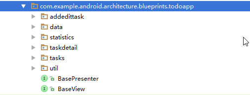
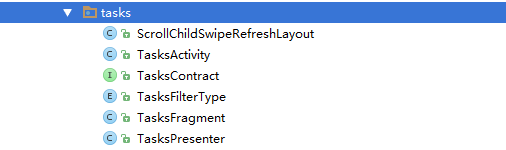
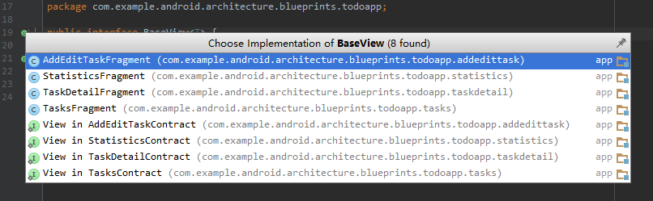

## 写在前面
「MVP」架构在很多的编程项目中都可以用到，作为一个初学 Android 不久的人来说，这个架构应该能够帮助我们更好的组织我们的项目。冲着这个目的，自己也就趁机研究了一下「MVP」。同时也算是自己的一些探索吧，感觉自己的眼界太窄，所以不得不多吸收知识来充实自己。毕竟是初学者，我尽可能把我所了解到的东西分享给大家。如果有问题，可以联系我或者进行评论。
<!-- more -->
## 说明
这个 MVP 的介绍的项目主要是 Google 在 GitHub 上开源的一个 Android MVP 的实现，分析也是基于它的「android-architecture」项目下的子项目 「todo-mvp」。下面是项目的 GitHub 地址，有兴趣的同学可以尝试研究一下。

GitHub地址: [Android Architecture Blueprints](https://github.com/googlesamples/android-architecture?utm_source=tuicool&utm_medium=referral)

## 正文
### 什么是 MVP
MVP 全称是 Model-View-Presenter，是在 Model-View-Controller(MVC) 的基础上形成的一个新的架构。MVP 多数用在 UI 界面丰富的项目中。为了避免项目的整体结构过于复杂以及项目中单个文件的过度臃肿，使用 MVP 来让整体框架更加清晰，也更有利于进行模块化的开发、debug 的进行。想了解更多的同学可以看更多的关于 [MVP](https://en.wikipedia.org/wiki/Model%E2%80%93view%E2%80%93controller) 和  [MVC](https://en.wikipedia.org/wiki/Model%E2%80%93view%E2%80%93controller) 的介绍。

下面是在维基百科上找到的一张关于 MVP 设计范式的图解。


从上面可以看到，Presenter 充当了 Model 和 View 之间通讯的中间人。 Model 和 View 并不直接连接，这也就使得整个架构之间的关系变得比较简单明了。 在 View 中，用户触发了事件之后，View 就告诉了 Presenter， Presenter 从 View 中获取所需要的数据，然后对 Model 进行更新。Model 中发生的更新事件也是通过 Presenter 来传递给需要展示的 View。这样一来整个架构就显得很清晰。

### android-architecture/todo-mvp
下面进入到 todo-mvp 中来进行具体的分析。项目的总体结构如下图



可以看到，项目包含了两个公共的接口：BasePresenter 和 BaseView。这个项目中所有的 Presenter 都继承自 BasePresenter， 所有的 View 都是继承自 BaseView。

接着看界面，项目基本上是按照功能进行分类，项目总共要显示 4 个 UI 界面，AddEditTask(添加任务界面)、Statistics(统计界面)、TaskDetail(任务详情界面)、Tasks(总任务界面：主界面)。每个界面（功能）都单独分了一个包进行处理，自行对应上图。

另外要注意的就是 data 包和 util 包，data 文件夹主要就是模拟生成数据的包，包含了对本地数据和远端数据的模拟，也就是关于数据的一层，也即 Model。而 util 包就是工具类的包，比如创建 fragment 并添加到对应的 Activity 中的工作。

下面来看 tasks 包的内容：



其中 ScrollChildSwipeRefreshLayout 和 TasksFilterType 分别是对 SwipeRefreshLayout 布局的一些刷新功能的重写以及对 Task 类型的状态进行枚举。

但是，最主要的还是 Activity、Contract、Fragment、Presenter。这四个类支撑起了整个 Tasks 界面。在着个项目中的其他界面中每一个都包含着相似的这四个类。看看官方的说法：
> In this version of the app, as well as other versions based on it, each screen is implemented using the following classes and interfaces:
> + A contract class which defines the connection between the view and the presenter.(*简单的说就是定义了 View 和 Presenter 之间的关联关系的 Contract 类*)
> + An Activity which creates fragments and presenters.(*生成了 fragment 和 Presenter 的 Activity*)
> + A Fragment which implements the view interface.(*实现了 View 接口的 Fragment*)
> + A presenter which implements the presenter interface in the corresponding contract.(*实现了对应的 Contract 中的 presenter 接口的 Presenter*)

括弧中的内容是我根据翻译和自己对项目的理解做的翻译，希望各位大佬不要笑话。接下来再进行深入的分析。

先从 Contract 开始， Contract 中定义了继承自 BaseView 的接口 View 以及继承自 BasePresenter 的 Presenter，同时还定义了 View 和 Presenter 在沟通的过程中所需要用到的各种方法。


上图中可以看到 BaseView 在四个界面的实现时都经过了 Contract 和 Fragment 的引用，前者声明接口，后者进行实现。

接着看 TasksPresenter 和 TasksFragment，前者是实现了 TasksContract 中的 Presenter 的接口，后者是继承了 Fragment 并且实现了 TasksContract 中的 View 接口。在 TasksPresenter 中声明了一个私有的变量 TasksContract.View，即 mTasksView。这个 mTasksView 就是和这个 TasksPresenter 相互关联的 View，同样的，在 TasksFragment 中也有一个相应的 TasksContract.Presenter。这是 View 和 Presenter 之间通信的基础。

让我们更深入一些！看当界面 TasksFragment 中发生点击事件时项目的内部发生了什么操作。在 TasksFragment 中定义了一个事件监听 mItemListener，如下
``` java
/**
 * Listener for clicks on tasks in the ListView.
 */
TaskItemListener mItemListener = new TaskItemListener() {
    @Override
    public void onTaskClick(Task clickedTask) {
        mPresenter.openTaskDetails(clickedTask);
    }

    @Override
    public void onCompleteTaskClick(Task completedTask) {
        mPresenter.completeTask(completedTask);
    }

    @Override
    public void onActivateTaskClick(Task activatedTask) {
        mPresenter.activateTask(activatedTask);
    }
};
```
所以当我们的点击事件发生时，实际上就调用了与 TasksFragment(View) 相联系的 mPresenter，执行了 openTaskDetails 的方法， 于是跳到 TasksPresenter 中有对应的代码如下：
```  java
@Override
public void openTaskDetails(@NonNull Task requestedTask) {
    checkNotNull(requestedTask, "requestedTask cannot be null!");
    mTasksView.showTaskDetailsUi(requestedTask.getId());
}
```
Presenter 中可以进行相应的处理，可以和 Model 进行交互操作，此处是直接让对应的 TasksContract.View， 也即 mTasksView 执行了 showTaskDetailsUi 的方法。再次回到 TasksFragment 中：
``` java
    @Override
    public void showTaskDetailsUi(String taskId) {
        // in it's own Activity, since it makes more sense that way and it gives us the flexibility
        // to show some Intent stubbing.
        Intent intent = new Intent(getContext(), TaskDetailActivity.class);
        intent.putExtra(TaskDetailActivity.EXTRA_TASK_ID, taskId);
        startActivity(intent);
    }
```
看到 TasksFragment 的这个方法直接就打开了一个 Activity，也就是对应的 TaskDetailActivity。

最后看 Activity 中的内容，它主要就是生成了一个 TasksPresenter(mTasksPresenter) 和一个 TasksFragment(tasksFragment)，并通过工具类 util 把 tasksFragment 添加到 Activity 中。剩下的主要就是做一些与侧滑菜单和 Toolbar 相关的工作，之后就没有其他太多的功能了。

## 总结
经过上面的内容之后，我相信你对 MVP 在 Android 项目中的应用已经有了一定的了解。我们通过官方的示意图最后来复习一下：


在项目中， Activity 包含了 View 和 Presenter。View 主要是用 Fragment 进行实现。View 和 Presenter 之间的联系十分紧密，但 View 并不能直接与 Model 层相连接， 只有通过 Presenter 的帮助才能完成数据的交互。图中左侧部分就是 Model 层，主要实现数据的操作等逻辑处理。

吼了，就这样结束吧，一写就停不下来，停不下来就要写好久。。。
加油！

参考文章：

[Android MVP 详解（上）](http://www.jianshu.com/p/9a6845b26856)

[todo-mvp的README.md](https://github.com/googlesamples/android-architecture/tree/todo-mvp/)

<center> --- end --- </center>

---
